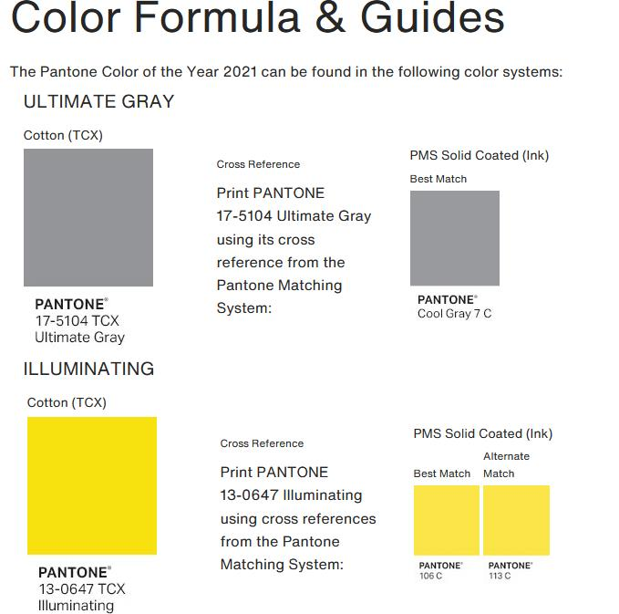
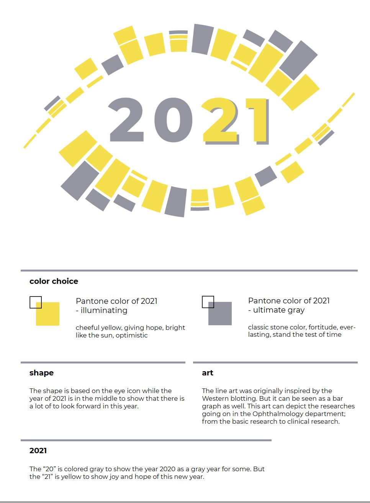

# THE STORY

When I was working at UMass Medical School, the Ophthalmology Department was looking to update the department logo. 
Somehow I was having design fever again and wanted to dust off my design skill.
I have been involved in my lab's website and knew many people in the department, so why not.

# DESIGN IDEA / THINKING

## ICON / BASE DESIGN

Our lab (and many other research-side teams) has several genetic projects. 
I was looking into how to merge / mix / assimilate something that is perceived as genetic with something that is like an eye. 

### GENETIC

Few ideas I had about some visuals that are common in genetic studies are:
- Blots (like western blot, Southern blot, northwestern blot, etc.)
- Marking of mutations in a chromosome
- Exon splices

### EYE

I guess there is not much variety or there is no need for an out-of-the-box idea for an eye
- A full eye, anterior view
- Sagittal view of eyeball 
- The iris

## COLOR

I had known about Pantone way before, but Pantone color of the year somehow became a big news recently and it felt the color had become a trendy influencers topic. 
The color of the 2021 was somehow a two-colors instead of one. 

There some info on the meaning of each color, and I thought they could fit to the department vision or current situation.
So I decided to just use these 2 colors.

# CREATION

I came up with three different styles.

  

## COMMON AMONG 3

I couldn't come up with three totally different ideas; so, these 3 have very similar workflows:
- I used Adobe Illustrator circular pattern
    - First, I created a custom brush, based on some pattern of genetic icons I came up earlier. 
    - Then, I created a circle line vector.
    - Finally, I applied the line using custom brush instead of a solid line. 

- The 2021 text is the same on all three
    - The **20** uses the gray color to mark both the unchanging part of the year (the two thousand), as well as that we just passed the year 2020, and the 20**20** being marked gray can mean as the *off*. 
    - The **21** uses the yellow (Illuminating) to mark the new year, and maybe the new meaning (we were just starting to get used to COVID19 life anyway).

### ART 1

The eye part is based on the iris, while the line is more like line-chart but I can say it is like exon splices too. 
There is a flare on the inner lower left, just mimicking how eye icon has flare to show the transparency.

### ART 2

The eye base is technically a full front eye. 
The original logo of UMass Eye Center used this style of eye as well (and many other eye clinics).
The line part was inspired a bit from the Southern blot, but technically it was created using R as a stacked bar graph.

### ART 3

The idea is similar to Art 1, but there is more flair added. 
The line part was like chromosome even though it was created with random ellipse tools.

# SELECTION

In the end I selected Art 2 since I like the stacked bar graph line. Art 1 is good too, but it doesn't really show like an eye. Art 3 is just too busy.

# IN THE END

The deparment had a form to submit the designs. 
I even created a report form to explain my thinking: 

But the decision makers in the end decided not to change their old logo at all 😓.

